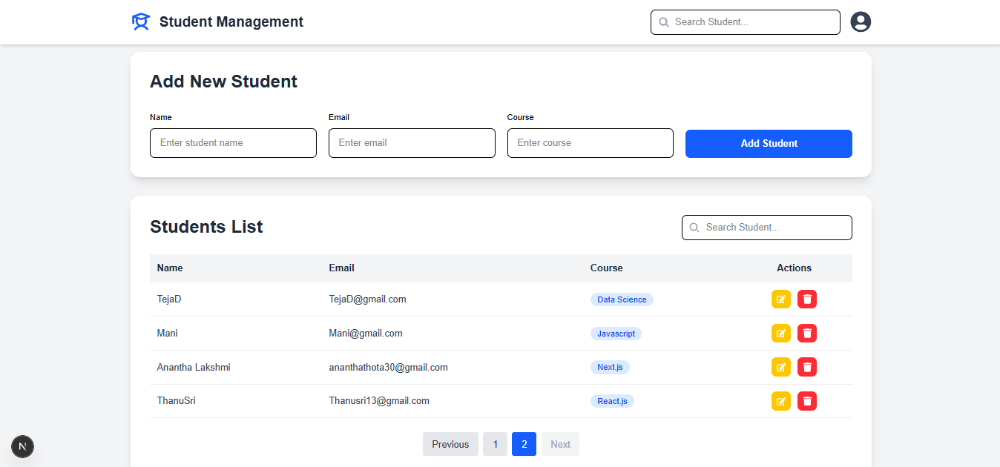
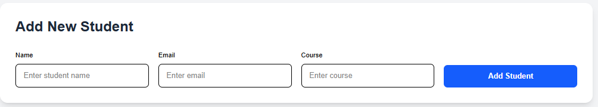
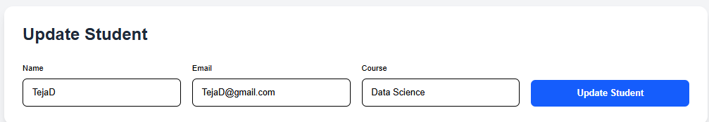
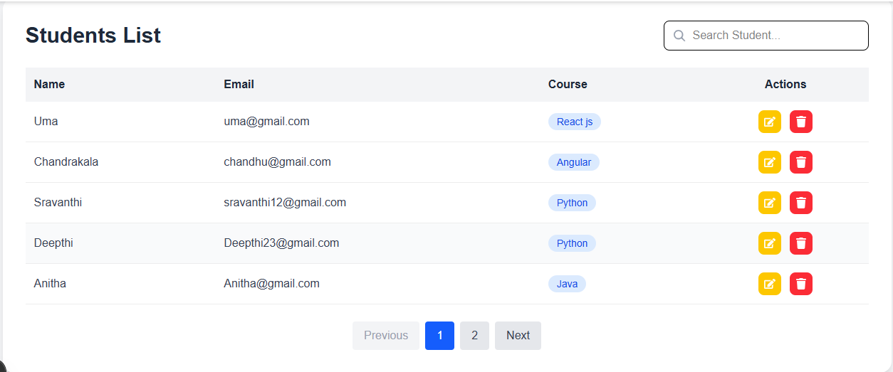

# 🎓 Student Management System

A modern full-stack **Student Management System** built with **Next.js 16**, **React 19**, **Prisma ORM**, **PostgreSQL (Neon)**, and **Tailwind CSS**.

This application demonstrates complete CRUD operations with a clean UI, server actions, search, pagination, and responsive design.

---

## 🚀 Live Demo

🌐 **Live Website:** https://your-vercel-url.vercel.app

📂 **GitHub Repository:** https://github.com/AnanthaThota/student-management-nextjs.git

---

# ✨ Features

* ✅ Add Student
* ✅ Update Student
* ✅ Delete Student
* ✅ View Students
* ✅ Search by Name, Email, or Course
* ✅ Pagination (5 records per page)
* ✅ Server Actions
* ✅ Prisma ORM
* ✅ PostgreSQL (Neon Database)
* ✅ Toast Notifications
* ✅ Responsive Design

---

# 🛠️ Tech Stack

| Technology      | Description      |
| --------------- | ---------------- |
| Next.js 16      | React Framework  |
| React 19        | UI Library       |
| TypeScript      | Type Safety      |
| Prisma ORM      | Database ORM     |
| PostgreSQL      | Database         |
| Neon            | Cloud PostgreSQL |
| Tailwind CSS    | Styling          |
| React Hot Toast | Notifications    |

---

# 📸 Application Screenshots

## 🏠 Home Page

![Home Page]

---



## ➕ Add Student



---

## ✏️ Update Student


---

## 🔍 Search Students


---

## 📄 Pagination



---


# 📂 Project Structure

```text
student-management-nextjs
│
├── app
│   ├── actions
│   ├── components
│   ├── lib
│   ├── layout.tsx
│   └── page.tsx
│
├── prisma
│   └── schema.prisma
│
├── public
├── screenshots
├── package.json
├── tsconfig.json
├── next.config.ts
└── README.md
```

---

# ⚙️ Installation

### Clone Repository

```bash
git clone https://github.com/AnanthaThota/student-management-nextjs.git
```

### Navigate to Project

```bash
cd student-management-nextjs
```

### Install Dependencies

```bash
npm install
```

### Create Environment Variable

Create a `.env` file in the project root.

```env
DATABASE_URL="your_neon_database_url"
```

### Generate Prisma Client

```bash
npx prisma generate
```

### Push Database Schema

```bash
npx prisma db push
```

### Run Development Server

```bash
npm run dev
```

Visit:

```
http://localhost:3000
```

---

# 📋 Database Schema

```prisma
model Student {
  id        Int      @id @default(autoincrement())
  name      String
  email     String   @unique
  course    String
  createdAt DateTime @default(now())
}
```

---

# 📚 What I Learned

During this project I learned:

* Next.js 16 App Router
* React 19
* Prisma ORM
* PostgreSQL with Neon
* Server Actions
* CRUD Operations
* Search Functionality
* Pagination
* Tailwind CSS
* Git & GitHub
* Vercel Deployment

---

# 🔮 Future Improvements

* User Authentication
* Role-Based Access Control
* Dashboard Analytics
* Export Students to Excel/PDF
* Image Upload
* Sorting
* Dark Mode

---

# 👨‍💻 Author

**Anantha Lakshmi**

Frontend Developer

### Connect with me

* LinkedIn: https://www.linkedin.com/in/anantha-lakshmi-thota-4412b6418
* GitHub: https://github.com/AnanthaThota

---

